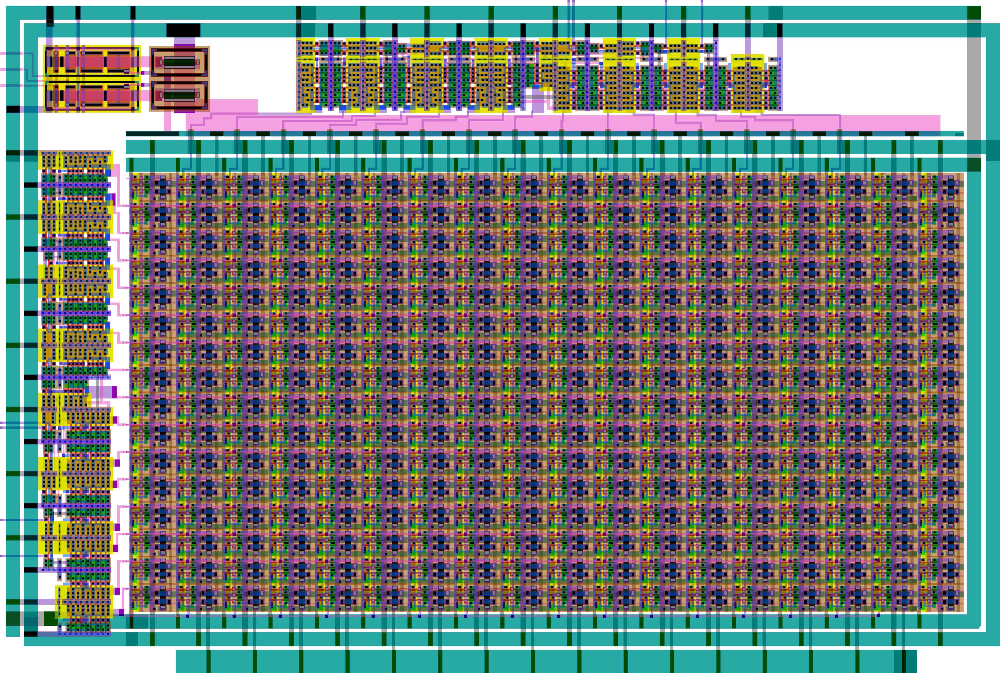
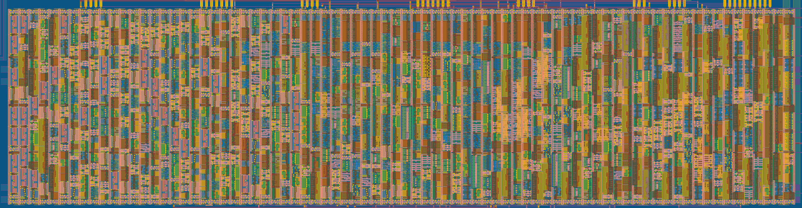

<!---

This file is used to generate your project datasheet. Please fill in the information below and delete any unused
sections.

You can also include images in this folder and reference them in the markdown. Each image must be less than
512 kb in size, and the combined size of all images must be less than 1 MB.
-->

## Overview

This is a revision of the same design as was [submitted to TTSKY25a](https://tinytapeout.com/chips/ttsky25a/tt_um_algofoogle_vga_matrix_dac). Both projects continue from my previous VGA DAC experiments ([tt06-grab-bag](https://github.com/algofoogle/tt06-grab-bag), [tt08-vga-fun](https://github.com/algofoogle/tt08-vga-fun), and [ttihp0p3-antonalog](https://github.com/algofoogle/ttihp0p3-antonalog)), to produce 24-bit analog outputs (red, green, and blue channels of 8 bits each) and drive a VGA monitor.

The TTSKY25a version is expected to have some bad output glitches near the points where it would switch between rows. This was mostly found (in simulation, at least) to be caused by capacitive coupling between the column select lines and the Vbias straps -- thus briefly pulling the Vbias line as multiple column select lines all switch at the same time (which would have an increasingly severe effect when more icells are turned on). This TTSKY25b version attempts to improve on that with much better shielding of the Vbias line, as well as a lower-impedance Vbias generator circuit.

## How it works

Like the TTSKY25a version, this project implements three current-switching DACs, intended for generating analog VGA display signals, using a 16x16 matrix of unit current sources, converting 8-bit digital inputs to inverted analog current sink "outputs" in the range of 3.3V down to 1.3V (depending on external pull-up resistance).

First, a "unit" current cell ("icell") layout is created, which includes a 3.3V-capable current sink NFET with a tiny bit of digital logic that allows the cell to be activated by row/column intersection, or by the whole row being turned on as one. Above that cell is higher-level routing that will make it cooperate and mesh with its neighbours:

These are arranged into a row of 16 cells, plus a dummy cell either side to help improve matching:

16 instances of the row are stacked, and combined with two 4-to-15 thermometer encoder blocks (i.e. 4 MSBs of the input code becomes the "row select" while the 4 LSBs become the "column select") plus the "Vbias" programmable reference voltage circuit for controlling the amount of current each "icell" will sink:

Three instances of this are combined with a digital controller block that is hardened with OpenLane 2, and then manually placed as a macro using the Magic VLSI layout tool:

The controller interfaces with the outside world using the standard Tiny Tapeout pinout, and besides generating the VGA control signals, it also generates various test patterns and pretty displays which it sends to the 3 DACs. 

TBC!

## How to test

TBC!

The TinyVGA PMOD can be used with this design, for basic digital RGB222 (6-bit colour) output.

To test the analog outputs, though: Use a pull-up resistor on each of the red, green, and blue analog output pins -- pull up to 3.3V using (say) a 500-ohm or 1k resistor, then shift this to 0-0.7V using an inverting opamp configuration. Alternatively, use a TIA (Transimpedance Amplifier) externally.

Set Vbias internally using digital inputs (through 8 possible levels).

For more information on the digital control block's test modes, you can mostly use the TT08 version's documentation as your reference: https://tinytapeout.com/chips/tt08/tt_um_algofoogle_tt08_vga_fun

## External hardware

TBC!

*   VGA display, optionally with the TinyVGA PMOD.
*   3 opamp circuits for converting each colour channel's current sink to a 0-0.7V range.
